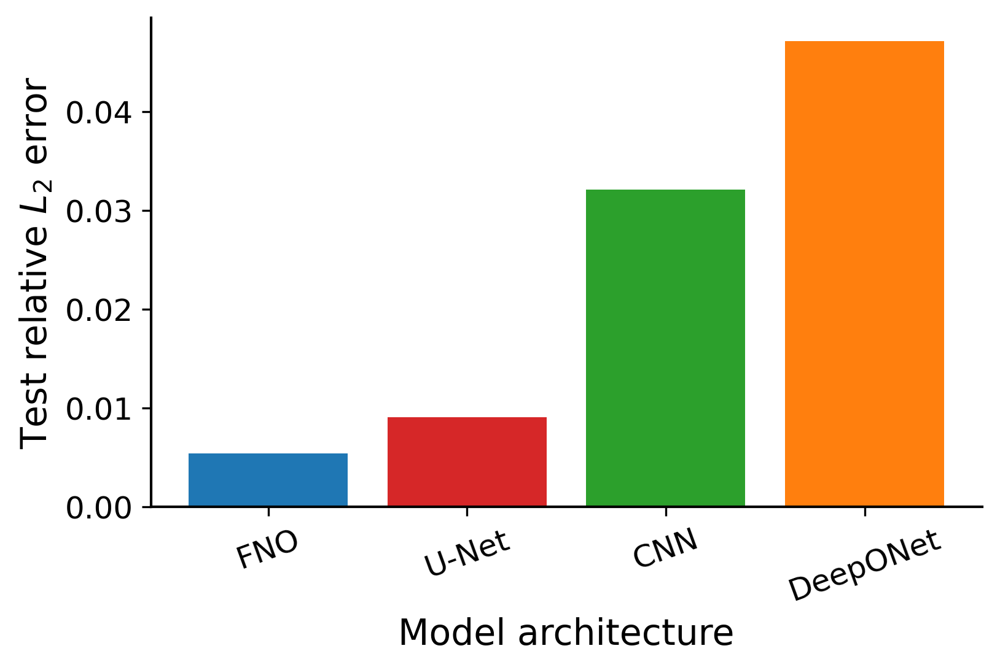
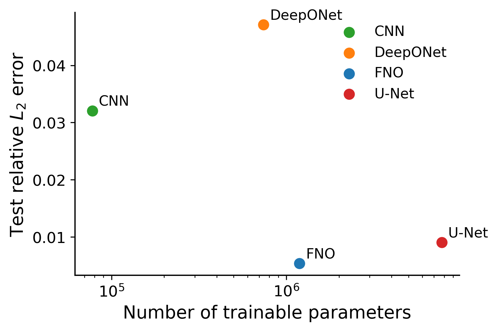
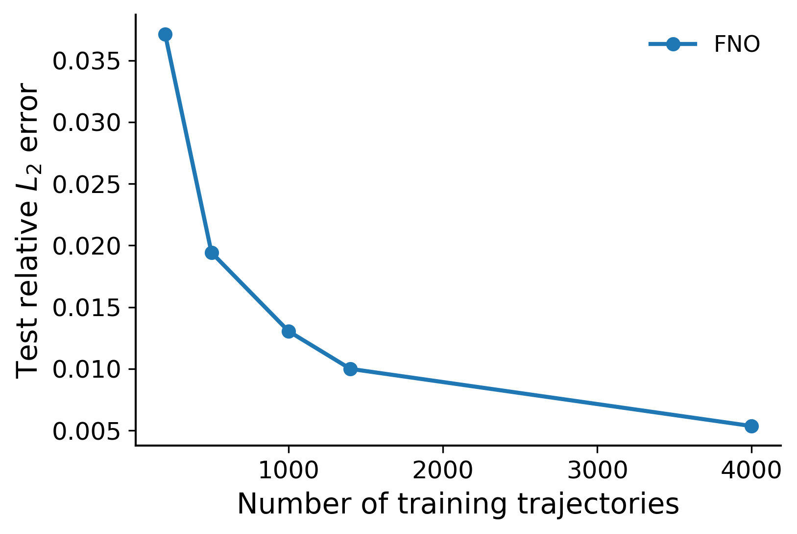
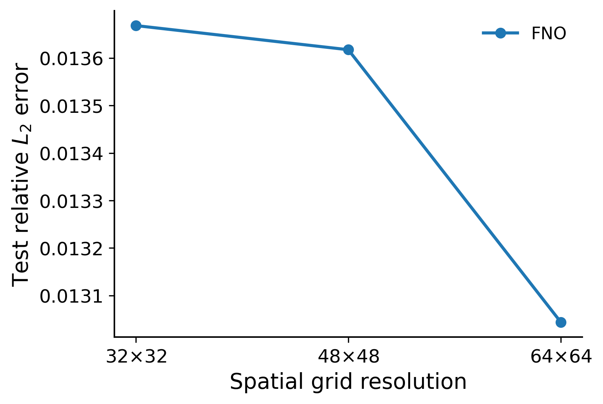
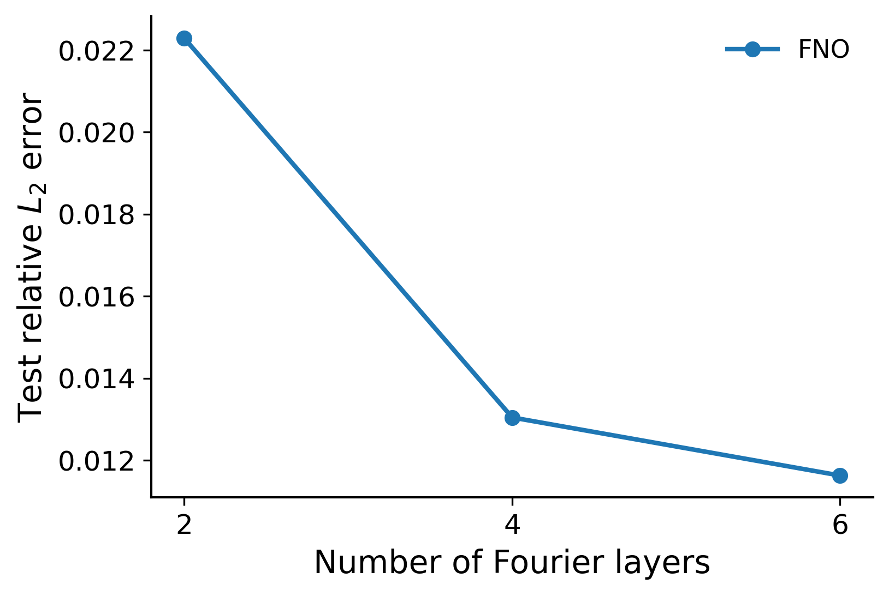

# Neural Operator Learning for Navier--Stokes PDEs

This repository contains a reproducible deep learning project for **Neural Operator Learning** on the 2D Navier--Stokes equation. It implements and compares **FNO**, **DeepONet**, **CNN**, and **U-Net**, and studies how neural operator generalization changes with **training data size**, **network depth**, and **spatial resolution**.

The project was developed for the *Deep Learning and Applications* course at Shanghai Jiao Tong University, Spring 2026. A short project paper is available here: [Neural-Operator-Learning.pdf](Neural-Operator-Learning.pdf).

## Highlights

- **Neural operator focus.** Implements Fourier Neural Operator (FNO) and a DeepXDE-style DeepONet branch--trunk architecture for grid-based PDE forecasting.
- **Strong baselines.** Includes a residual CNN and a U-Net baseline to compare neural operators against standard image-to-image regression models.
- **Complete experimental coverage.** Runs four required experiment groups:
  - model comparison: FNO vs DeepONet vs CNN vs U-Net;
  - data scaling: varying the number of training trajectories;
  - depth scaling: varying the number of FNO Fourier layers;
  - resolution scaling: varying the spatial grid resolution.
- **Local GPU ready.** Tested on a single NVIDIA RTX 3060 Laptop GPU with 6GB VRAM.
- **Reproducible outputs.** Each run saves `config.yaml`, `metrics.json`, `history.csv`, the best checkpoint, training curves, and prediction examples.
- **Paper-ready figures.** Provides scripts to generate NeurIPS-style clean plots and qualitative prediction visualizations.

## Main Results

The main model comparison uses the public Navier--Stokes benchmark from the FNO implementation, preprocessed to `N=5000`, `T=20`, with the split

```text
train / validation / test = 4000 / 500 / 500
input steps / output steps = 10 / 10
spatial resolution = 64 x 64
```

| Model | Test relative L2 ↓ | Test MSE ↓ | Parameters | Training time |
|---|---:|---:|---:|---:|
| **FNO** | **0.005359** | **0.000057** | 1.19M | 547s |
| U-Net | 0.009068 | 0.000149 | 7.77M | 596s |
| CNN | 0.032061 | 0.001730 | 0.078M | 352s |
| DeepONet | 0.047125 | 0.003749 | 0.742M | 410s |

Compared with U-Net, CNN, and DeepONet, **FNO reduces the test relative L2 error by approximately 40.9%, 83.3%, and 88.6%**, respectively. Compared with U-Net, FNO also uses about **84.7% fewer parameters**.

### Ablation Findings

- **Data scaling.** Increasing the training set from 200 to 1400 trajectories reduces FNO test error by about **73.1%**. Including the 4000-trajectory FNO run, the reduction reaches about **85.6%**.
- **Resolution scaling.** Increasing resolution from `32 x 32` to `64 x 64` only reduces error by about **4.6%** under fixed training size, suggesting diminishing returns from resolution alone.
- **Depth scaling.** Increasing FNO depth from 2 to 4 Fourier layers reduces error by about **41.5%**, while increasing from 4 to 6 layers only yields an additional **10.9%** reduction.

These observations are useful for the report: **training data size is the most effective lever**, while simply increasing resolution or depth has limited marginal benefit under a fixed data budget.

## Example Figures

<p align="center">
  
  
</p>

<p align="center">
  
  
  
</p>

## Repository Structure

```text
.
├── configs/
│   ├── default.yaml              # default experiment config
│   ├── final_gpu.yaml            # report-scale local GPU config
│   ├── experiments.yaml          # suite definitions
│   └── *_fast.yaml               # model-specific quick configs
├── scripts/
│   ├── check_gpu.py              # verify PyTorch CUDA environment
│   ├── prepare_official_data.py  # convert official .mat file to .npz
│   ├── train.py                  # train one experiment
│   ├── run_experiments.py        # run experiment suites
│   ├── summarize_results.py      # collect metrics.json into CSV
│   ├── make_final_clean_summary.py
│   ├── plot_final_neurips.py
│   └── plot_qualitative_prediction.py
├── src/
│   ├── data.py                   # Navier--Stokes dataset and dataloaders
│   ├── trainer.py                # training / evaluation loop
│   ├── metrics.py
│   ├── utils.py
│   └── models/
│       ├── fno2d.py
│       ├── deeponet2d.py
│       ├── cnn.py
│       └── unet.py
├── assets/figures/               # README preview figures
├── results/tables/final/         # curated clean result table
├── requirements-local.txt
├── LICENSE
└── README.md
```

Large raw data, processed data, checkpoints, and run folders are intentionally ignored by Git.

## Installation

Create a local conda environment:

```bash
conda create -n no-ns python=3.10 -y
conda activate no-ns
```

Install PyTorch with CUDA. For CUDA 12.1:

```bash
pip install torch torchvision --index-url https://download.pytorch.org/whl/cu121
```

Install the remaining dependencies:

```bash
pip install -r requirements-local.txt
```

Verify the GPU:

```bash
python scripts/check_gpu.py
```

A successful setup should report `CUDA available: True` and show your GPU name.


## Dataset

This repository **does not include** the Navier--Stokes data files. The two files used in the experiments are large binary files and should not be committed to a regular GitHub repository:

```text
data/raw/NavierStokes_V1e-3_N5000_T50.mat
data/processed/NavierStokes_V1e-3_N5000_T20.npz
```

The raw `.mat` file is the public 2D Navier--Stokes benchmark used by the Fourier Neural Operator project. It contains 5000 trajectories on a `64 x 64` spatial grid with 50 time steps:

```text
NavierStokes_V1e-3_N5000_T50.mat
shape: [5000, 64, 64, 50]
```

Due to GitHub's file-size limits and repository-size recommendations, large datasets and processed arrays are excluded from version control. The repository keeps only code, configs, final tables/figures, and the report PDF.

### Download the raw data

Download the official FNO benchmark data file from the Fourier Neural Operator repository:

```text
https://github.com/scaomath/fourier_neural_operator
```

The original author URL

```text
https://github.com/zongyi-li/fourier_neural_operator
```

may redirect to the newer `neuraloperator/neuraloperator` library. For this project, the important file is still the benchmark file named:

```text
NavierStokes_V1e-3_N5000_T50.mat
```

After downloading, place it at:

```text
data/raw/NavierStokes_V1e-3_N5000_T50.mat
```

If the directories do not exist, create them first:

```bash
mkdir -p data/raw data/processed
```

On Windows Command Prompt, use:

```bat
mkdir data\raw
mkdir data\processed
```

### Preprocess the data

Convert the raw `.mat` file into the `.npz` file used by the training scripts:

```bash
python scripts/prepare_official_data.py \
  --input data/raw/NavierStokes_V1e-3_N5000_T50.mat \
  --output data/processed/NavierStokes_V1e-3_N5000_T20.npz \
  --n 5000 --t 20
```

On Windows Command Prompt, use:

```bat
python scripts/prepare_official_data.py ^
  --input data/raw/NavierStokes_V1e-3_N5000_T50.mat ^
  --output data/processed/NavierStokes_V1e-3_N5000_T20.npz ^
  --n 5000 --t 20
```

This creates:

```text
data/processed/NavierStokes_V1e-3_N5000_T20.npz
```

which keeps all 5000 trajectories and the first 20 time steps. The learning task uses the first 10 time steps as input and the next 10 time steps as prediction targets.

### If you already have the processed file

If you already generated or received

```text
NavierStokes_V1e-3_N5000_T20.npz
```

you can skip preprocessing and place it directly at:

```text
data/processed/NavierStokes_V1e-3_N5000_T20.npz
```

### Git tracking policy

The `.gitignore` file intentionally excludes the dataset and checkpoints:

```gitignore
data/raw/*
data/processed/*
results/runs/
*.pt
*.pth
*.ckpt
```

Only `.gitkeep` placeholders are kept under `data/raw/` and `data/processed/`, so the expected directory structure is visible without storing large files.


## Running the Experiments

### 1. Main model comparison

Runs FNO, DeepONet, CNN, and U-Net with `4000/500/500` train/validation/test split:

```bash
python scripts/run_experiments.py --suite model_comparison --profile fast --extra ^
  data.path=data/processed/NavierStokes_V1e-3_N5000_T20.npz ^
  data.n_train=4000 data.n_val=500 data.n_test=500 ^
  data.batch_size=8 data.num_workers=0 ^
  training.amp=false system.device=auto system.tf32=true
```

### 2. Data scaling

```bash
python scripts/run_experiments.py --suite data_scaling --profile fast --extra ^
  data.path=data/processed/NavierStokes_V1e-3_N5000_T20.npz ^
  data.n_val=500 data.n_test=500 ^
  data.batch_size=8 data.num_workers=0 ^
  training.amp=false system.device=auto system.tf32=true
```

### 3. Resolution scaling

```bash
python scripts/run_experiments.py --suite resolution_scaling --profile fast --extra ^
  data.path=data/processed/NavierStokes_V1e-3_N5000_T20.npz ^
  data.n_train=1000 data.n_val=500 data.n_test=500 ^
  data.batch_size=8 data.num_workers=0 ^
  training.amp=false system.device=auto system.tf32=true
```

### 4. Depth scaling

```bash
python scripts/run_experiments.py --suite depth_scaling --profile fast --extra ^
  data.path=data/processed/NavierStokes_V1e-3_N5000_T20.npz ^
  data.n_train=1000 data.n_val=500 data.n_test=500 ^
  data.batch_size=8 data.num_workers=0 ^
  training.amp=false system.device=auto system.tf32=true
```

## Summarizing and Plotting

Collect all run metrics:

```bash
python scripts/summarize_results.py --runs results/runs --out results/tables/summary_all.csv
```

If you keep separate suite-level CSV files under `results/tables/model_comparison/`, `results/tables/data_scaling/`, `results/tables/resolution_scaling/`, and `results/tables/depth_scaling/`, create a final clean table:

```bash
python scripts/make_final_clean_summary.py
```

Generate paper-style plots:

```bash
python scripts/plot_final_neurips.py ^
  --summary results/tables/final/summary_all_clean.csv ^
  --out_dir results/figures/final_neurips
```

Generate qualitative prediction figures from the latest FNO run:

```bash
python scripts/plot_qualitative_prediction.py ^
  --sample_index 0 ^
  --time_index -1 ^
  --filename qualitative_prediction_fno_sample0 ^
  --out_dir results/figures/final_neurips
```

Try multiple test samples:

```bash
python scripts/plot_qualitative_prediction.py --sample_index 1 --time_index -1 --filename qualitative_prediction_fno_sample1
python scripts/plot_qualitative_prediction.py --sample_index 2 --time_index -1 --filename qualitative_prediction_fno_sample2
python scripts/plot_qualitative_prediction.py --sample_index 3 --time_index -1 --filename qualitative_prediction_fno_sample3
```

## Technical Challenges

This project is not only a model comparison; several engineering details are necessary for stable and reproducible experiments.

1. **FNO FFT stability on local GPUs.** The FNO spectral convolution uses FFT operations. Mixed precision can cause cuFFT issues, especially when padding or non-power-of-two shapes are involved. The implementation keeps the FFT path in float32 and disables AMP by default.
2. **Fair split control.** Different experiment suites use fixed train/validation/test sizes to avoid confounding data size, resolution, and model structure.
3. **DeepONet adaptation.** DeepONet is naturally branch--trunk based and often used for function observations and coordinate queries. This repository adapts it to dense Navier--Stokes grid prediction while keeping the operator-learning interpretation.
4. **Result management.** Every run is timestamped. The final clean-summary script deduplicates repeated runs and creates report-ready CSV files.
5. **Limited GPU memory.** U-Net has about 7.77M parameters and can be memory intensive on a 6GB GPU. Batch size 8 worked in our setup; reduce to 4 if out-of-memory errors occur.

## GitHub Upload Checklist

Before uploading, the repository should contain code and curated small artifacts only:

```text
keep:    src/, scripts/, configs/, README.md, LICENSE, requirements*.txt, assets/, results/tables/final/summary_all_clean.csv
ignore:  data/raw/, data/processed/, results/runs/, checkpoints, .mat/.npz files
```

One-click Git workflow:

```bash
git init
git add .
git commit -m "Initial release: neural operator Navier-Stokes experiments"
git branch -M main
git remote add origin https://github.com/<your-username>/<your-repo-name>.git
git push -u origin main
```

Suggested repository name:

```text
neural-operator-navier-stokes
```

Suggested GitHub description:

```text
FNO, DeepONet, CNN, and U-Net experiments for Navier-Stokes neural operator learning with data, depth, and resolution scaling studies.
```

## Citation

If you use this project or the benchmark setup, please cite the FNO paper, the FNO public implementation, DeepONet, DeepXDE, U-Net, and standard deep learning references listed in the accompanying report.

## License

This repository is released under the MIT License. The Navier--Stokes dataset is not redistributed here; please obtain it from the original FNO benchmark source.
